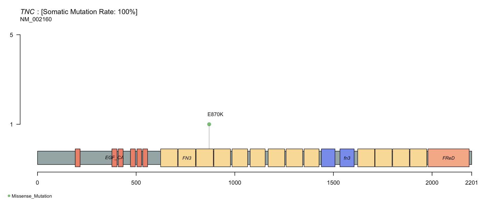

<!-- ## Circos plot -->

<!-- Four required files: -->

<!-- 1. segment data -->
<!--     - define the outmost track, or chromosome position. GRCh36, 37 and 38 are provided. -->
<!--     - three required fields: chromosome name, start position, end position -->

<!-- 2.  -->

## How to use this web application

This web application allows a user to analyze and visualize three types of variants: Single Nucleotide Variants, Structural Variants, and Copy Number Variants. There is a tab corresponding to each variant type. 

**Single Nucleotide Variants**:

There are four plots for this type of variant. Oncoplot, Summary plot, Lollipop plot, and Rainfall plot. I will explain all of them below.

**Oncoplot**: This plot provides information regarding the top genes that are mutated across the entire dataset. Genes are ranked according to the number of samples affected. The oncoplot presents information such as Variant classification (e.g. Missense_Mutation or Nonsense_Mutation), Tumor Mutational Burden for each variant types in individual samples.

**Summary plot**: This plot provides a group of plots prividing summary overview of the whole dataset in bar plots form. It counts the variant classifications, variant types, and top 10 mutated genes. 

**Lollipop plot**: The plot provides protein changes prediction information of a gene in a lollipop form. Users are expected to input which gene and which sample they are interested in.

<figure>
    
</figure>

For example in the above plot, the gene TNC is predicted to have an amino acid of length 2201. The colored segments are protein domain family, EGF_CA, FN3, fn3, and FReD. The "lollipop" means that there is a protein change from E to K at location 870.

**Rainfall plot**: This plot provides spatial information on a single sample level regarding the mutation events inter-distance and chromosome position. It also colors the mutation type.

**Structural Variants**

**Copy Number Variants**

The Copy Number Variants (CNV) plot visualizes the reads ratio with an indication line at ratio = 1. Any CNV above the line is considered as duplication, otherwise deletion. Users could select, out of two methods, how to render this plot. Users could supply coordinate and the plot will be rendered, or users could give a Hugo Symbol, then the plot would be renderedd around that gene location.

**Circos Plot**

This plot provides a composite visualization with all three types of variants. This plot is helpful in identifying spatial mutational hot spots, when all three variant types congregate to a specific chromosome or some coordinate regions. 